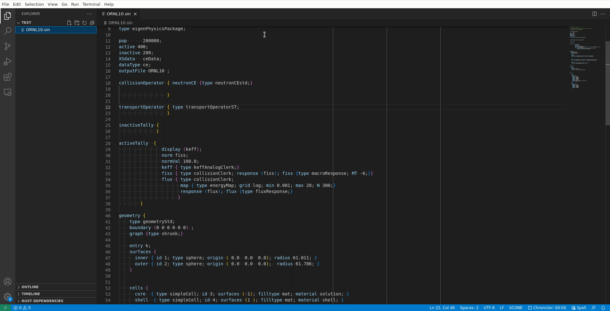

# scone-dictionary

Provides language configuration and highlighting to work with dictionaries
used as the input file for [SCONE Monte Carlo Code](https://github.com/CambridgeNuclear/SCONE)

## Features
Provides the usual basic features expected in a programming language configured for VSCode:

- Comment toggling (default: <kbd>ctrl</kbd><kbd>/</kbd>)
- Syntax highlighting;
- Automatic closing of nested dictionaries `{}` and list `();` entries.
- Automatic indentation

## Showcase

## Installation
Since the package is yet in its early development it has not been published
in the Marketplace yet. Installation instructions will follow soon...

